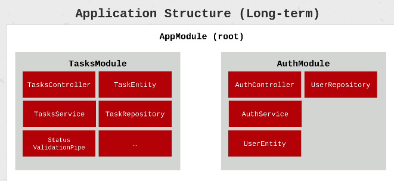
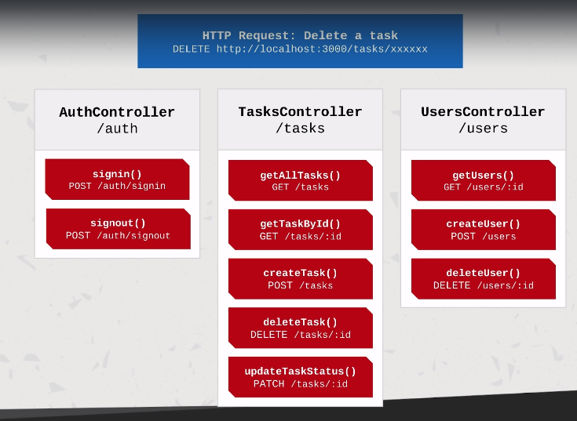

# Instalación del CLI

```shell
yarn global add @nestjs/cli
```

**Validar la versión instalada:**

 ```shell
 nest -v
 ```

## Estructura de una aplicación



## Crear un nuevo proyecto

```shell
nest new nombre_proyecto
```

## Correr el proyecto

```shell
yarn start:dev
```

## Module

* Cada aplicación tiene por lo menos un módulo (root module). Este es el punto de inicio de la aplicación.
* Los módulos son una forma eficaz de organizar componentes mediante un conjunto de capacidades estrechamente relacionadas.
* Es una buena practica tener una carpeta por módulo.
* Un módulo es singleton, por lo tanto un módulo puede ser inportado multiples veces desde otros otros módulos.
* Esta definido por una clase que esta anotada por el decorador: @Module.
* El decorador provee metadata que Nest usa para organizar la estructura de la aplicación.
* Propiedades del decorador:
  * providers: Un array de providers que estarán disponibles dentro del módulo a través de la inyección de dependencias.
  * controllers: Una array de controladores que seran instanciados con el módulo.
  * exports: Un array de providers a exportar a otros módulos.
  * imports: Una lista de módulos rqueridos por este módulo. Algun provider exportado por estos módulos pueden ser ahora accesibles en nuestro modulo via inyección de dependencias.

### Generar módulo

```shell
nest g module name
```

## Controller

* Responsable de manejar el request entrante y devolver el response al cliente.
* Contiene los manejadores de los endpoints y los metodos request (GET, POST, DELETE etc).
* Puede consumir providers del mismo módulo a través de la inyección de dependencias.
* Estan definidos por una clase que esta decorada con @Controller.
* El decorador acepta un string, el cual es el path a ser manejado por el decorador.

### Handler

* Los handlers son mètodos de la clase controlador, decorados con @Get, @Post, @Delete.



**Generate:**

```shell
nest g controller tasks --no-spec
```

## Providers

* Pueden ser inyectados dentro del contructor si esta decorado como un @Injectable, via inyecciòn de dependencias.
* Puende ser un valor plano, una clase, sync/async factory.
* Pueden ser exportados desde un mòdulo y entonces estan disponibles a otros mòdulos que los importan.

### Service

* Se define como un provider, no todos los providers son servicios.
* Actua como Singleton cuando se envuelve con @Injectable y se proporciona al mòdulo, la misma instancia sera compartida a través de la aplicación, actuando como una unica fuente de la verdad.
* La principal fuente de lógica del negocio. Un servicio será llamado desde un controlador para validar la data, crear un item en la base de datos y retornar una respuesta.

**Generate:**

```shell
nest g service tasks --no-spec
```


## Dependency Injection

* Nosotros definimos la dependencia en el contrustor de la clase. NestJS tamaría asistencia de la inyección de dependencia por nosotros, y entonces estarán disponibles como una propiedad de la clase.

## Data Transfer Object

* Es un objeto que transporta datos entre procesos.
* Es un objeto que es usado para encapsular datos, y enviarlos desde un subsistema de una aplicación a otro.
* Es un objeto que define como los datos son enviados a través de la red.
* No tienen ningun comportamiento, escpeto para almacenamiento, recuperación, serealización y deserealización de datos.
* Puede ser usado para validación de datos.
* No son una definición de un modelo. Este define la forma de datos para un caso específico.
* Puede ser definido usando una interface o una clase. El enfoque recomendado es utilizar clases. LLa razón es que las interfaces son parte de TypeScript y, por lo tanto, no se conservan después de la compilación. Las clases nos permiten hacer más y, dado que son parte de javascript, se conservarán después de la compilación. NestJS no puede referirse a interfaces en tiempo de ejecución, pero puede referirse a clases.
* Estos no son obligatorios, se puede desarrollar aplicaciones sin el uso de DTOs, sin embargo el valor que agregan hacen que valga la pena usarlos cuando corresponda.
* Aplicar este patron tan pronto sea posible hace que sea fácil el mantenimiento y la refactorización de código.
* 

therefore - por lo tanto

however - sin embargo

worthwhile - vale la pena

across - a través