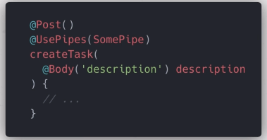
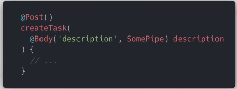
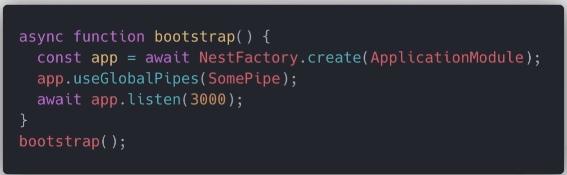

# Instalación del CLI

```shell
yarn global add @nestjs/cli
```

**Validar la versión instalada:**

 ```shell
 nest -v
 ```

## Estructura de una aplicación


## Crear un nuevo proyecto

```shell
nest new nombre_proyecto
```

## Correr el proyecto

```shell
yarn start:dev
```

## Module

* Cada aplicación tiene por lo menos un módulo (root module). Este es el punto de inicio de la aplicación.
* Los módulos son una forma eficaz de organizar componentes mediante un conjunto de capacidades estrechamente relacionadas.
* Es una buena practica tener una carpeta por módulo.
* Un módulo es singleton, por lo tanto un módulo puede ser inportado multiples veces desde otros otros módulos.
* Esta definido por una clase que esta anotada por el decorador: @Module.
* El decorador provee metadata que Nest usa para organizar la estructura de la aplicación.
* Propiedades del decorador:
  * providers: Un array de providers que estarán disponibles dentro del módulo a través de la inyección de dependencias.
  * controllers: Una array de controladores que seran instanciados con el módulo.
  * exports: Un array de providers a exportar a otros módulos.
  * imports: Una lista de módulos rqueridos por este módulo. Algun provider exportado por estos módulos pueden ser ahora accesibles en nuestro modulo via inyección de dependencias.

### Generar módulo

```shell
nest g module name
```

## Controller

* Responsable de manejar el request entrante y devolver el response al cliente.
* Contiene los manejadores de los endpoints y los metodos request (GET, POST, DELETE etc).
* Puede consumir providers del mismo módulo a través de la inyección de dependencias.
* Estan definidos por una clase que esta decorada con @Controller.
* El decorador acepta un string, el cual es el path a ser manejado por el decorador.

### Handler

* Los handlers son mètodos de la clase controlador, decorados con @Get, @Post, @Delete.


**Generate:**

```shell
nest g controller tasks --no-spec
```

## Providers

* Pueden ser inyectados dentro del contructor si esta decorado como un @Injectable, via inyecciòn de dependencias.
* Puende ser un valor plano, una clase, sync/async factory.
* Pueden ser exportados desde un mòdulo y entonces estan disponibles a otros mòdulos que los importan.

### Service

* Se define como un provider, no todos los providers son servicios.
* Actua como Singleton cuando se envuelve con @Injectable y se proporciona al mòdulo, la misma instancia sera compartida a través de la aplicación, actuando como una unica fuente de la verdad.
* La principal fuente de lógica del negocio. Un servicio será llamado desde un controlador para validar la data, crear un item en la base de datos y retornar una respuesta.

**Generate:**

```shell
nest g service tasks --no-spec
```


## Dependency Injection

* Nosotros definimos la dependencia en el contrustor de la clase. NestJS tamaría asistencia de la inyección de dependencia por nosotros, y entonces estarán disponibles como una propiedad de la clase.

## Data Transfer Object

* Es un objeto que transporta datos entre procesos.
* Es un objeto que es usado para encapsular datos, y enviarlos desde un subsistema de una aplicación a otro.
* Es un objeto que define como los datos son enviados a través de la red.
* No tienen ningun comportamiento, escpeto para almacenamiento, recuperación, serealización y deserealización de datos.
* Puede ser usado para validación de datos.
* No son una definición de un modelo. Este define la forma de datos para un caso específico.
* Puede ser definido usando una interface o una clase. El enfoque recomendado es utilizar clases. La razón es que las interfaces son parte de TypeScript y, por lo tanto, no se conservan después de la compilación. Las clases nos permiten hacer más y, dado que son parte de javascript, se conservarán después de la compilación. NestJS no puede referirse a interfaces en tiempo de ejecución, pero puede referirse a clases.
* Estos no son obligatorios, se puede desarrollar aplicaciones sin el uso de DTOs, sin embargo el valor que agregan hacen que valga la pena usarlos cuando corresponda.
* Aplicar este patron tan pronto sea posible hace que sea fácil el mantenimiento y la refactorización de código.


## Pipes

* Opera sobre los argumentos procesados por el manejador de rutas, justo antes que el manejador sea llamado.
* Puede realizar transformación y validación de datos.
* Pueden retornar datos originales o modificados, los cuales seran pasados al manejador de rutas.
* Pueden lanzar excepciones. Estas pueden ser manejadas por Nest.js y parseadas dentro de una respuesta con error.
* Pueden ser asincronas.
* Por defecto Nest.js viene con algunos pipes utiles dentro del paquete @nest/common module.

### ValidationPipe

* Valida la compatibilidad de un objeto completo con una clase. Si alguna propiedad no se puede mapear correctamente, la validación fallará.

### ParseIntPipe

* Por defecto los argumentos son string. Este pipe valida que un argumento es un número.
* Si es exitoso, el argumento es transformado a un Number y pasado al Controlador.

### Implementación de Pipes custom

* Son clases anotadas con el decorador @Injectable().
* Las pipes deben implementar la interface PipeTransform. Por lo tanto cada pipe debe tener a método transform(). Este método puede ser llamado por NestJS para procesar los argumentos.
* El método transform() acepta dos parámetros:
  * value: El valor del argumento procesado.
  * metadata: (opcional): Un object que contiene la metadata del argumento.
* Lo que sea devuelto por el método transform() será pasara al controlador. Las excepciones pueden ser devueltas al cliente.

### Pipes a nivel de Controlador



* Son definidos al nivel del controlador de la ruta, a través del decorador @UsePipes().
* Los pipes puden ser consumidas en diferentes lugares. Dicha tubería procesara todos los parámetros para la solicitud entrante.
* Requieren algo más de código, pero proporcinan grander beneficios No requieren código extra a nivel de parámetros.
* Fáciles de matener y extender. Si el modelo de datos cambia, es fácil hacer los cambios necesarios solamente dentro del pipe.
* La responsabilidad de identificar los argumentos a procesar se transfieren a un archivo central. El archivo del pipe.
* Promueve el uso de DTOs, que es una buena préctica.

### Pipes a nivel de parámetros:



* Sólo se procesará el parámetro específico para el que se ha específicado el pipe.
* Tienden a ser mas ligeros y limpios. Sin embarg, ellos a menudo resultan agregar codigo extra a los controladores, esto puede volverse complicado y difícil de mantener.

### Pipes Globales



* Son definidas a nivel de aplicación y serán aplicadas a cualquier solicitud entrante.

**Create pipe**

Add class validator and transformer

```shell
yarn add class-validator class-transformer
```

## Instalation Postgres

### Docker

```shell
# Iniciar
docker run --name postgres-nest -p 5432:5432 -e POSTGRES_PASSWORD=postgres -d postgres

# Parar el contenedor
docker container stop postgres-nest

#Eliminar el contenedor
docker container rm postgres-nest
```

## ORM (Object Relational Mapping)

* Es una técnica que le permite consultar y manipular datos de una base de datos, utilizando un paradigma orientado a objetos.

### Pros.

* Escribir el modelo en un solo lugar, ayuda a ser más fácil el mantenimiento y menos repetición.
* Muchas cosas echas automáticamente, como el manejo de la base de datos, tipos de datos, relaciones etc.
* No necesitas escribir la sintaxis sql, fácil de aprender, difícil de dominar.
* Abstracción de la base de datos, puedes cambiar el tipo de base de datos cuando tu lo desees.

### Cons.

* Las librerias ORM no son el camino simple, se debe aprender.
* Tienen buen performance, pero es fácil descuidar este punto.
* Hace fácil olvidar o no aprender lo que esta ocurriendo detrás de el ORM, llevándonos a un gran problema de mantenimiento.

## TypeORM

* Corre en Node.js y puede ser usada con TypeScript o JavaScript.
* Ayuda a definir y administrar entidades, repositorios, columnas, relaciones, replicación, indices, queries, logging y mucho mas.

### Instalar

```shell
yarn add typeorm @nestjs/typeorm pg
```

## Active Record vs Data Mapper

* **Active Record:** Se define todo los métodos queries del modelo mismo y se guarda, remueve o carga objetos usando métodos del modelo. es un enfoque para acceder a su base de datos dentro de los modelos.
* **Data Mapper:** Se define todos los métodos query en una clase separada llamada "Repositories", y guardar, remover y cargar objetos usando repositorios. Aquí las entidades son tontas, estas solamente definen sus propiedades y de ser posible algunos métodos dummy.


therefore - por lo tanto

however - sin embargo

worthwhile - vale la pena

across - a través

any - cualquiera

which - cuales

which one - cual

tend - tienden

tend to be - tienden a ser

however: sin embargo

often - a menudo

such - tal

within - dentro de

shifted - transferir

that lets you - que le permite

there are - existen

that allow - que permiten

rather than - en vez de

lots of - mucho

done - hechas (de hacer)

wish - deseo

leverages - apalanca

achieve - lograr

alright - esta bien

neglect - descuidar

behind - detrás

behind the scenes - entre bastidores

approach - enfoque